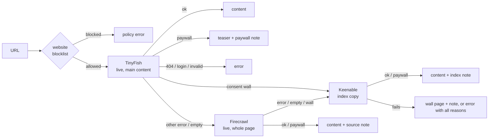

# hermes-extract-chain

A [Hermes Agent](https://github.com/NousResearch/hermes-agent) plugin that makes `web_extract` fall back across three page-fetch services (**TinyFish → Firecrawl → Keenable**) and tells the model where the text came from.

Hermes uses exactly one extract provider. If it fails on a page (bot protection, a consent wall), the model gets an error. Its only built-in fallback, the keyless rescue, runs when *every* URL of a call fails, and swaps in anonymous providers without saying so. This plugin registers one provider, `extract-chain`, that tries the next service per URL. When the result did not come straight from the first service, it adds a short note at the top of the text.

On 54 URLs (mostly German news, plus Stack Overflow, a 404 page and Python docs), it got 29 of 30 free articles complete, against 20 for TinyFish alone. No free article got a false paywall or consent-wall note. Details: [docs/validation.md](docs/validation.md).

Why these three services, in this order, comes from a comparison of six providers (TinyFish, Firecrawl, Keenable, Parallel, Exa, Tavily) on correctness, freshness, consent walls and paywalls. Test scenarios, result tables and data: [docs/evaluation.md](docs/evaluation.md) and [`data/`](data).

## How it works



| TinyFish returns | Next | The model gets |
|---|---|---|
| content | – | the content, no note |
| a teaser with paywall markers | – | the teaser + `Paywall indicators found …` |
| `page_not_found`, `login_required`, `invalid_url`, `invalid_redirect_url`, `content_too_large` | – | the error |
| another error (`bot_blocked`, `target_http_error`, `timeout`, …) or an empty page | Firecrawl | the content + `Live fetch via Firecrawl (TinyFish: …)` |
| a cookie/consent wall | Keenable | the copy + `Copy from Keenable's index; it may be older …` |

If all stages fail, the model gets one error with every reason, e.g. `TinyFish: bot_blocked; Firecrawl: target HTTP 403; Keenable: Gateway timeout`. Each provider is asked at most once per URL; URLs of one call run concurrently.

Example of what the model sees:

```text
[extract-chain] Live fetch via Firecrawl (TinyFish: bot_blocked).

# Article title
…
```

## Requirements

- Hermes Agent ≥ 0.21. Tested live with Hermes Desktop 0.21.6 on Windows; the plugin and extract code paths were checked against the v0.21.6 release that the Docker image is built from.
- API keys for three page-fetch services:
  - [TinyFish](https://tinyfish.ai): fetch API returning a page's main content as Markdown; required; free tier 1,000 URLs/day.
  - [Firecrawl](https://firecrawl.dev): scraping API with a browser and proxies, returns the article with much of the page around it; free tier 1,000 credits/month.
  - [Keenable](https://keenable.ai): search index that serves stored copies of pages; free tier 100,000 requests/month.

  Without a Firecrawl or Keenable key, that stage is skipped.
- Network access to `api.fetch.tinyfish.ai`, `api.firecrawl.dev` and `api.keenable.ai` (HTTPS; `HTTPS_PROXY` is honoured).

No extra Python packages: the plugin only uses `httpx`, which ships with Hermes.

## Installation

**Manual (recommended):** copy the directory `extract_chain/` as `plugins/extract-chain/` into your Hermes home.

| Setup | Target directory |
|---|---|
| Linux / macOS | `$HERMES_HOME/plugins/extract-chain/`; the Hermes home is usually `~/.hermes` |
| Official Docker image | `/opt/data/plugins/extract-chain/` (`/opt/data` is the mounted Hermes home) |
| Hermes Desktop (Windows), per profile | `%LOCALAPPDATA%\hermes\profiles\<profile>\plugins\extract-chain\` |

```bash
git clone https://github.com/Pressimize/hermes-extract-chain.git
cp -r hermes-extract-chain/extract_chain "${HERMES_HOME:-$HOME/.hermes}/plugins/extract-chain"
```

Then enable it in the profile's `config.yaml` (user plugins are opt-in) and select it:

```yaml
plugins:
  enabled:
    - extract-chain          # add to your existing entries
web:
  extract_backend: extract-chain
  keyless_rescue: false      # otherwise Hermes silently replaces fully failed calls
  # extract_timeout: 120     # default; keep it at 110 or more
```

`web.extract_timeout` bounds the whole call. The chain needs at most 105 s per URL (40 s TinyFish + 40 s Firecrawl + 25 s Keenable); with a lower value, Hermes cancels slow chains and returns a timeout error for every URL of the call.

Put the keys into the profile's `.env`:

```bash
TINYFISH_API_KEY=...
FIRECRAWL_API_KEY=...
KEENABLE_API_KEY=...
```

Restart Hermes (or the gateway).

**With Hermes' installer:** Hermes can install a plugin from a Git subdirectory and asks for the keys:

```bash
hermes plugins install Pressimize/hermes-extract-chain#extract_chain --enable
```

It clones only the `extract_chain` subdirectory, asks for the three keys and enables the plugin. The `web:` settings above are still needed. Enabling through Hermes' CLI also syncs Hermes' package environment. The plugin needs no packages, but the manual route avoids that step entirely, which can matter in containers built from the official image. The manual route is the one we tested.

**Check:** let the agent read a page. `logs/agent.log` in the Hermes home then shows a line per URL:

```text
extract-chain www.stern.de: tinyfish=bot_blocked firecrawl=ok
```

## Update and uninstall

- **Update:** replace the `plugins/extract-chain/` directory with the new `extract_chain/` and restart Hermes. After a Git install, use `hermes plugins update extract-chain`. See [CHANGELOG.md](CHANGELOG.md).
- **Uninstall:**
  1. Delete `plugins/extract-chain/`.
  2. Remove `extract-chain` from `plugins.enabled`.
  3. Set `web.extract_backend` back to your previous provider.
  4. Restart Hermes.

## Notes the model may see

| Note | Meaning |
|---|---|
| `Live fetch via Firecrawl (TinyFish: <reason>).` | TinyFish failed; the text is Firecrawl's live copy of the whole page |
| `Copy from Keenable's index; it may be older than the live page (live fetch: <reasons>).` | Both live fetches failed or hit a consent wall; the text is an index copy |
| `Paywall indicators found; the text is probably only the free teaser.` | Paywall markers were found; no further provider is asked |
| `Consent wall detected; no alternative source found (<reasons>). The text below is the consent page.` | Only a consent page could be fetched |
| `PDF cut to the first 30 of <n> pages (Firecrawl page cap).` | A long PDF came via Firecrawl, which bills per page |

## Limitations

- **Paywalls are not bypassed.** Many paywalled teasers carry no marker; they are returned as normal text. Seen at FAZ, SZ, Welt, Handelsblatt and Tagesspiegel.
- **Keyword rules.** Wall and paywall detection uses marker phrases tuned on German news sites, plus common English consent phrases. An article *about* paywalls or cookie banners can trigger a note. English-language paywalls are mostly not detected.
- **Index copies** (Keenable) can be older than the live page; the note says so.
- **Privacy.** Every URL is sent to TinyFish, and possibly to Firecrawl and Keenable.
- **Fixed providers and order;** see the FAQ.
- **Hermes caches** successful results, notes included, for `web.cache_ttl_minutes` (default 20).

Edge cases and failure behaviour: [docs/troubleshooting.md](docs/troubleshooting.md).

## Costs and quotas

Firecrawl is only used when TinyFish fails, and PDFs are capped at 30 pages there (one credit per page). Firecrawl still bills target 403/404 pages it returns as documents. For a hard cost cap, keep these off: TinyFish wallet auto-reload, Firecrawl auto-recharge, Keenable auto top-up. With them off, an exhausted quota gives HTTP 402, and the chain moves on to the next stage. It then skips the exhausted provider without a request: TinyFish until five minutes after its daily reset at 00:00 UTC, Firecrawl and Keenable for 24 hours (`paused` in the log). Watch usage in the log:

```bash
grep -o "firecrawl=[a-z_0-9]*" logs/agent.log | sort | uniq -c
```

## FAQ

**Can I swap providers or change their order?**
Not at the moment. Each stage plays a role the rules depend on:

- **TinyFish** is the cheap first stage. It batches URLs, returns the main content, and its error codes decide whether a fallback can help.
- **Firecrawl** is the live fallback for bot-protected pages. Even when asked for the main content only, it returns much of the page around the article, so the paywall check skips the last quarter, where footers and subscription dialogs sit.
- **Keenable** serves index copies, which get past consent walls. That is why a consent wall skips Firecrawl, and why Keenable results carry the "may be older" note.

Making providers configurable would need an adapter per provider declaring its role: live or index copy, main content or whole page, batch size and final error codes. It would also need an ordered list in the config, and the rules re-validated for each new provider. Why these three were chosen, with the test data: [docs/evaluation.md](docs/evaluation.md).

**Why not reuse Hermes' built-in Firecrawl and Keenable providers?**
Hermes' Firecrawl provider needs the `firecrawl-py` SDK, which Hermes installs on first use. Calling the REST APIs directly needs nothing extra and gives control over timeouts, freshness and PDF limits.

**Does it apply Hermes' website blocklist?**
Yes. Hermes leaves this check to each provider. The plugin checks every URL before any request, and the final URL after redirects. If a Hermes update ever moves the blocklist module, the plugin refuses every URL with a clear error instead of fetching without the blocklist.

**Does it do web search?**
No. `web.search_backend` is unaffected.

## Development

```bash
uv sync                                   # Python >= 3.11, httpx as in Hermes
uv run ruff check && uv run ruff format --check
uv run pytest
```

| Path | Content |
|---|---|
| `extract_chain/` | The plugin: `provider.py` (Hermes interface), `chain.py` (classification, chain, notes), `fetchers.py` (REST clients) |
| `tests/` | Unit tests without network (`httpx.MockTransport`; Hermes is stubbed in `conftest.py`) |
| `scripts/replay.py` | Replays the chain on stored raw results; the raw article texts are not published |
| `scripts/live_check.py` | Calls Hermes' real `web_extract` path in a test profile, without an LLM and with rate limiting |
| `docs/` | [evaluation](docs/evaluation.md) (provider choice, test scenarios), [design](docs/design.md), [validation](docs/validation.md), [troubleshooting](docs/troubleshooting.md) |
| `data/` | Test data without article texts: URL lists and per-URL results as CSV |

`pyproject.toml` only configures the tooling. It sits at the repository root on purpose: Hermes treats a plugin directory that contains a `pyproject.toml` as a package-manager member.

## Authors

- [Pressimize](https://github.com/Pressimize): idea, requirements and decisions.
- Claude, Anthropic's AI model, working in Claude Code: design, code, tests, evaluation and documentation.

## License

[MIT](LICENSE)
